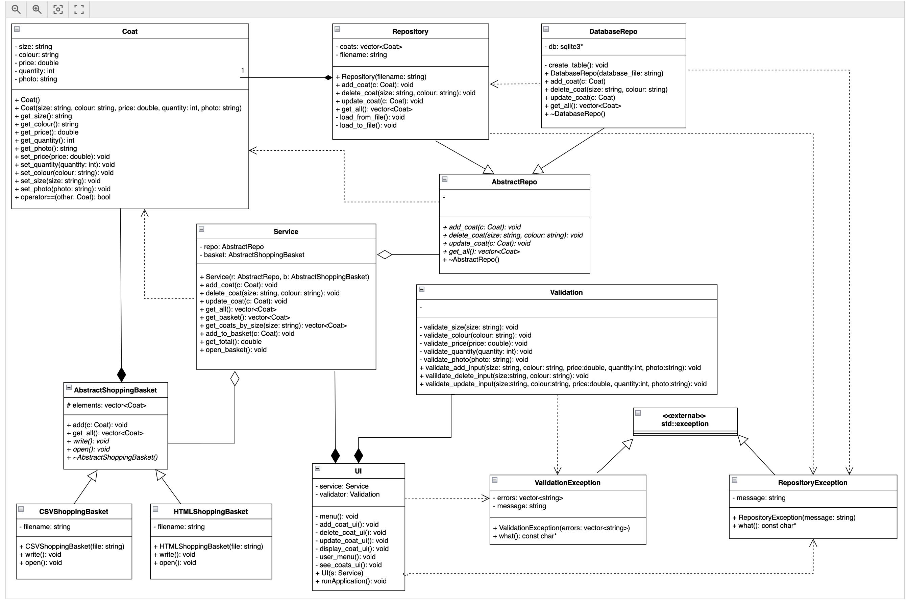

<h1>Trench Coats Shopping Application </h1>

  <strong>A C++ and Qt desktop storefront with inventory management, persistent storage, and a complete customer shopping workflow.</strong>

 

  
  
  

  
  
  

---

## Overview

Developed in multiple iterations across Object-Oriented Programming assignments, the application evolved from a console-based inventory manager into a complete Qt desktop application. This app is an enhanced version of the one required at uni, with cleaner structure etc.

It provides two operating modes:
* **Administrator mode** for managing the store inventory
* **User mode** for browsing trench coats and managing a shopping basket

The project demonstrates layered architecture, STL containers and algorithms, file and database persistence, custom validation and exceptions, inheritance and polymorphism, CSV and HTML export, undo and redo operations, and Qt’s Model/View architecture.

## Technologies and Concepts
* C++
* Qt
* CMake
* Layered architecture
* Object-oriented programming
* STL containers and algorithms
* File persistence
* CSV and HTML export
* Custom exceptions and validation
* Inheritance and polymorphism
* Qt Model/View architecture
* Undo and redo functionality
* Unit testing

## Main Features

### Administrator Mode

Administrators can:

* Add a new trench coat
* Remove a trench coat when it is sold out
* Update an existing trench coat
* View all trench coats in the store
* Undo and redo add, remove, and update operations

Each trench coat contains:

* Size
* Colour
* Price
* Quantity
* Photograph URL

> Duplicate entities cannot be added. Attempts to update or remove an entity that does not exist are rejected and reported to the user.

### User Mode

Users can:

* Browse trench coats of a specified size
* Browse all trench coats when no size is specified
* View trench coats one by one
* Add trench coats to the shopping basket
* Skip to the next available trench coat
* Continue browsing from the beginning after reaching the end (looping)
* View the shopping basket and its total price
* Save the shopping basket as a CSV or HTML file

## Architecture

The application follows a layered architecture:

* Domain
* Repository
* Service
* Validation
* Shopping basket
* User interfaces (both console-based and GUI)
* Tests

> Input data and entities are validated before reaching the repository. Repository and validation errors are communicated using custom exception classes.

## Development Iterations

### Iteration 1 — Core Application and Administrator Mode

The first iteration established the main structure of the application and the admin mode,

Implemented requirements:

* C++ implementation using layered architecture
* A dynamically allocated `DynamicVector` class
* Administrator operations for adding, removing, updating, and displaying trench coats
* Input and entity validation
* Duplicate detection (a coat is unique by size + colour)
* Error handling for update and delete operations on nonexistent entities
* Specifications and tests for non-trivial functions outside the UI
* At least 98% test coverage for all layers except the UI

### Iteration 2 — User Mode

The second iteration introduced the user mode.

Implemented requirements:

* Filtering trench coats by size
* Displaying all trench coats when the size is left empty
* Browsing trench coats one by one
* Opening the photograph of the displayed trench coat automatically, in the web browser
* Adding trench coats to the shopping basket
* Updating and displaying the total price after each purchase
* Circular navigation through the available trench coats
* Displaying the shopping basket and its total price

### Iteration 3 — STL and File Persistence

The third iteration modernised the implementation and introduced persistent storage.

Implemented requirements:

* Replacement of the custom `DynamicVector` with `std::vector`
* Use of STL algorithms where appropriate
* Replacement of traditional loops with STL algorithms or range-based `for` loops
* Storage of repository data in a text file
* Loading entities from the file when the application starts
* Saving modifications during program execution
* Custom insertion and extraction operators for entities
* File handling using the standard I/O library

### Iteration 4 — Exceptions, Polymorphism, and Export Formats

The fourth iteration improved error handling and introduced multiple shopping basket formats.

Implemented requirements:

* Custom repository exceptions
* Custom validation exceptions
* Validator classes for domain entities
* Program input validation
* CSV shopping basket export
* HTML shopping basket export
* Runtime selection of the preferred file format
* Opening the saved CSV or HTML file with the appropriate external application
* Inheritance and polymorphism for the shopping basket implementations
* A UML class diagram covering the entire application

> Note: CSV and HTML files are used only as application outputs. Repository data is not loaded from these files.

### Iteration 5 — Qt Graphical Interface

The fifth iteration introduced a graphical user interface using Qt.

Implemented requirements:

* Qt-based graphical interface
* Administrator inventory displayed using data loaded from the input file

### Iteration 6 — Complete GUI Functionality

The sixth iteration transferred all application functionality to the graphical interface.

Implemented requirements:

* All administrator and user operations available through the GUI
* One-by-one browsing preserved in user mode
* Shopping basket functionality integrated into the GUI
* Behaviour consistent with the previous console-based implementation

### Iteration 7 — Undo/Redo and Qt Model/View

The final iteration added command history and a dedicated table model.

Implemented requirements:

* Multiple undo and redo operations
* Undo and redo support for adding, removing, and updating trench coats
* Inheritance and polymorphism for undoable actions
* Undo and Redo buttons
* Keyboard shortcuts:

  * `Ctrl+Z` for Undo
  * `Ctrl+Y` or `Ctrl+Shift+Z` for Redo
* Shopping basket displayed using `QTableView`
* Custom table model derived from `QAbstractTableModel`
* Shopping basket table opened in a separate window

## Testing and Validation

The application includes:

* Unit tests for non-trivial functions outside the UI
* High test coverage across the domain, repository, service, and validation layers
* Validation of trench coat attributes
* Validation of user input
* Duplicate prevention
* Custom exceptions for repository and validation errors

## UML Diagram

